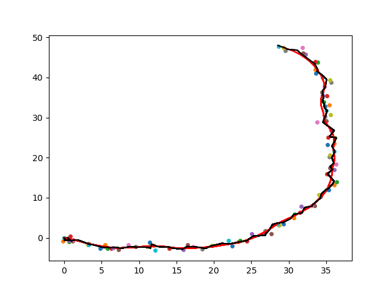

# EKF

## Build & Run
```
$ bash make.sh
& bash run.sh
```


## Results
**black line**: estimated trajectory by EKF
**red line**: ground truth trajectory
**dot**: observation



## Algorithm explanation

**states** $\boldsymbol{x} = [x, y, yaw, vx]^T$
**observation** $\boldsymbol{z} = [x, y, yaw, vx]^T$
**control inputs** $\boldsymbol{u} = [vx, yawrate]^T$

### Problem formulation

#### State equation
$\boldsymbol{x_{T}} = f\left(\boldsymbol{x_{T-1}}, \boldsymbol{u_{T}}\right)$

$ \begin{bmatrix}
x_T \\
y_T \\
\psi_{T} \\
v_T \\
\end{bmatrix} =
\begin{bmatrix}
x_{T-1} \\
y_{T-1} \\
\psi_{T-1} \\
v_{T-1} \\
\end{bmatrix} +
\begin{bmatrix}
v \cos{\psi} \Delta t\\
v \sin{\psi} \Delta t\\
\dot{\psi} \Delta t \\
v\\
\end{bmatrix} $


#### Observation equation
$\boldsymbol{z = h(x)} $

$\begin{bmatrix}
x_{obs} \\
y_{obs} \\
\psi_{obs} \\
v_{obs} \\
\end{bmatrix} =
\begin{bmatrix}
x \\
y \\
\psi \\
v \\
\end{bmatrix}
$

### EKF algorithm

#### Prediction update
1. $\boldsymbol{x_{T}} = f\left(\boldsymbol{x_{T-1}}, \boldsymbol{u_{T}}\right)$
2. $\boldsymbol{P = F P F^T + Q}$

where $F$ denotes jacobian
$\boldsymbol{F} = \frac{\partial A}{\partial x} = \begin{bmatrix}
1 & 0 & -v \sin{\psi} \Delta t & \cos{\psi} \Delta t \\
0 & 1 &  v \cos{\psi} \Delta t & \sin{\psi} \Delta t \\
0 & 0 &                      1 &                   0 \\
0 & 0 &                      0 &                   1 \\
\end{bmatrix} $

and $Q$ denotes covariance of process noise

#### Observation update
1. $K = P H^T \left( H P H^T \right)^{-1} + R$
2. $\boldsymbol{x} = \boldsymbol{x} + K \left( \boldsymbol{z} - h(\boldsymbol{x}) \right)$
3. $P = \left( I - KH \right) P$

$\boldsymbol{H} = \begin{bmatrix}
1 & 0 & 0 & 0 \\
0 & 1 & 0 & 0 \\
0 & 0 & 1 & 0 \\
0 & 0 & 0 & 1 \\
\end{bmatrix} $